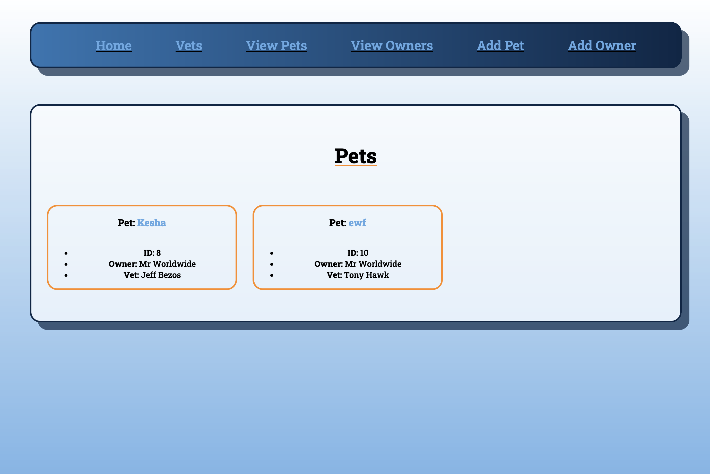
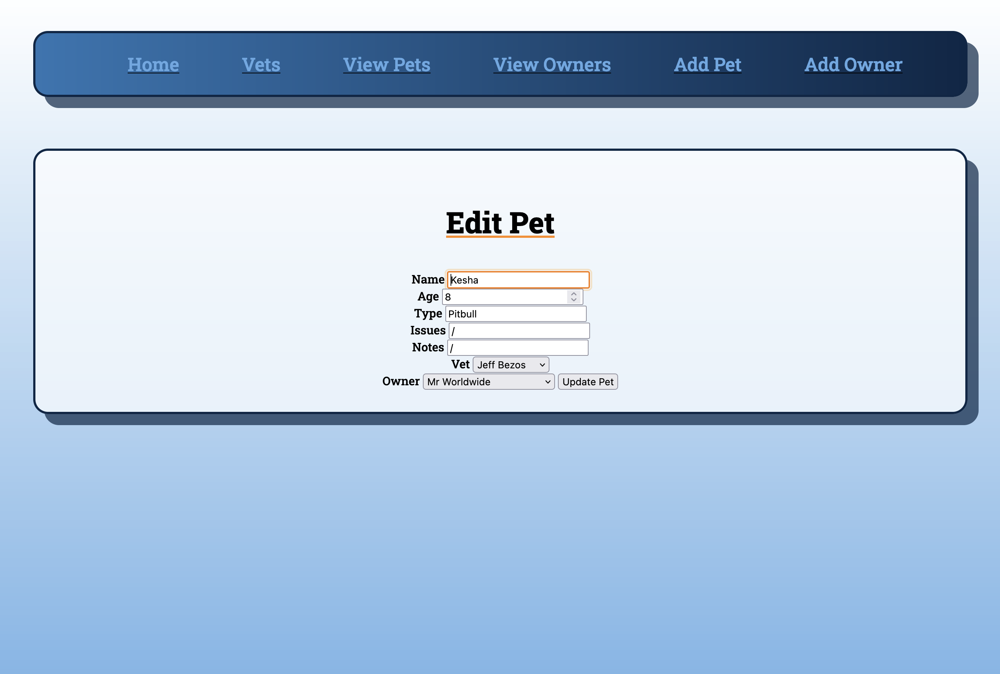
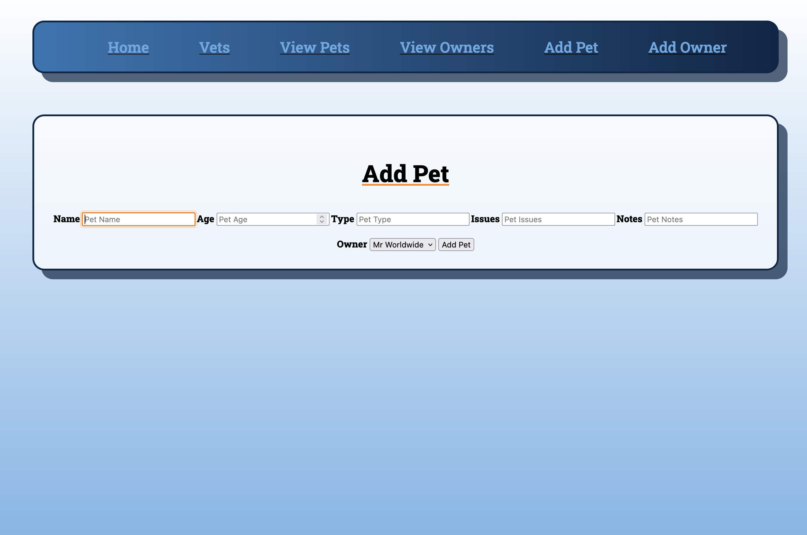

<h1>VetClan</h1>
<h3>A full stack veterinary app created with Flask</h3>

The aim for this project was to create a full stack crud app using Flask.

Looking back at the project I would have liked to modeled it on a pre-existing site to achieve a more professional looking product.

